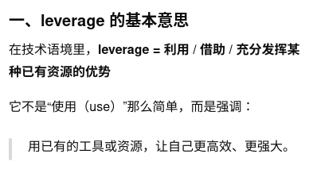

**providing insights into** creating efficient and reusable images

提供创建高效且可复用镜像的见解

-----
Finally, you will explore how to publish your image on Docker Hub, **enabling you to** share your work with the broader community and **leverage** Docker's powerful ecosystem **for** collaborative development and deployment.

最后，你将探索如何在 Docker Hub 上发布你的镜像，使你能够与更广泛的社区分享你的作品，并利用 Docker 强大的生态系统进行协作开发和部署。

----
Getting Docker Desktop up and running is the first crucial step for developers **diving into** containerization, offering a seamless and user-friendly interface for managing Docker containers. 

让 Docker Desktop 的运行是开发者进入容器化领域的第一个关键步骤，提供无缝且用户友好的界面来管理 Docker 容器。